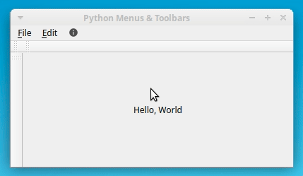
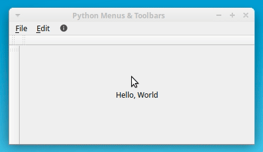
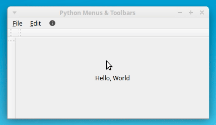
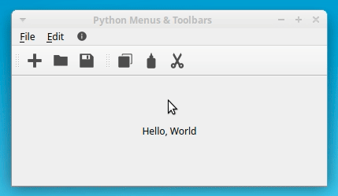

## 第十四部分 案例

实现目标

桌面客户端 简单工具箱

### pyqt5 篇

#### 基础布局

- [hello](./simple-tool-box/src/hello.py)
- [hello-oop](./simple-tool-box/src/hello.py)
- [水平布局](./simple-tool-box/src/h_layout.py)
- [垂直布局](./simple-tool-box/src/v_layout.py)
- [宫格布局](./simple-tool-box/src/g_layout.py)
- [表单布局](./simple-tool-box/src/f_layout.py)

#### 弹框

- [基本弹框](simple-tool-box/src/dialog.py)

#### 创建主弹框

- [一个主窗口](simple-tool-box/src/main_window.py)

> 注意:当您以自己的方法实现不同的 GUI 组件时,您正在使代码更具可读性和可维护性。但是,这不是一个依赖,因此您可以自由地以您最喜欢的方式组织代码。


到目前为止,您已经领略了 PyQt5 系列小部件中一些更重要的字符组件。在接下来的两个部分中,您将领略与 PyQt GUI 应用程序相关的其他重要概念。

#### Applications

在 `PyQt` 中,任何 `QT` 例都被视为 `application`。每个 `PyQt GUI` 应用程序必须有一个 `QApplication` 对象。申请的一些职责包含:

- 初始化
- 事件轮询和事件处理
- 系统维度和应用维度的设置
- 系统全局信息,例如应用目录、窗口长度、等等
- 转换一般的命令行参数
- 定义应用的外观
- 提供本地化能力

##### 事件轮询

GUI 应用程序由事件驱动。这意味着,函数和方法是响应用户操作执行的,如单击按钮、从组合框中选择项目、在文本编辑中输入或更新文本、按键盘上的键等。这些用户操作通常称为事件。

事件通常由事件循环(也称为主循环)处理。事件循环是一个无限循环,其中处理和发送来自用户、窗口系统和任何其他源的所有事件。事件循环等待事件发生,然后调度它执行某些任务。事件循环继续工作,直到应用程序终止。

所有 GUI 应用程序都使用事件循环。事件循环是一种等待事件发生的无限循环。如果发生事件,则循环检查事件是否是终止事件。在这种情况下,循环被终止,应用程序退出。否则,事件将发送到应用程序的事件队列以进行进一步处理,循环将重新开始。

> PyQt 最初开发为针对 Python 2 的目标, 它已经有一个`exec`关键字。在早期版本中,在`.exec_`末尾添加了一个下划线,以帮助避免名称冲突。`Pyqt5` 的目标是 `Python 3`, 它没有`exec`关键字。尽管如此,库还是提供了启动事件循环的两种方法:
>

1. exec_()
2. exec()

要触发响应操作,则依赖将事件与要执行的操作连接起来。在 `PyQt5` 中,您可以使用信号和插槽机制建立该连接。您将在下一节中涵盖这些内容。

#### 信号和插槽

PyQt 小部件充当活动捕捉者。这意味着每个小部件都能捕捉到特定数量的事件,如鼠标点击、按键等。为了响应这些事件,小部件总是发出信号,这是一种宣布其状态变化的信息。信号本身不执行任何操作。

如果您想要触发操作的信号,则依赖将其连接到插槽。这是每当发出连接信号时执行操作的函数或方法。您可以使用任何 Python `callable` (或`回调`) 作为插槽。

如果信号连接到插槽,则每当发出信号时,都会调用插槽。如果信号未连接到任何插槽,则不会发生任何事件,并且会忽略信号。以下是此机制的一些最有用的函数:

- 一个信号可以连接到一个或多个插槽。
- 一个信号也可能连接到另一个信号。
- 一个插槽可能连接到一个或多个信号。

您可以使用以下语法将信号连接到插槽:

```python
widget.signal.connect(slot_function)
```

这将slot_function连接到小部件的信号。每当发出信号时,都会调用`slot_function()`。此代码向您展示如何使用信号和插槽机制:

[插槽与信号](src/signals_slots.py)

注意:每个小部件都有自己的一组预定义信号。您可以在小部件的文档页面上查看它们。

如果您的插槽函数依赖接收额外的参数,则您可以使用 `functools.partial`传递它们。例如,您可以修改问候如下:

```python
def greeting(who):
  """Slot function."""
  if msg.text():
    msg.setText('')
  else:
    msg.setText(f'Hello {who}')
```

此时,你可以自定义参数

```python
btn.clicked.connect(functools.partial(greeting, 'World!'))
```

要使此代码工作,您依赖首先导入 `functools`。调用 `functools.partial()`返回一个对象, 其行为类似于与`greeting() with who='World!'.`,当用户单击按钮时,"Hello
World！" 消息将像以前一样显示在标签中。

现在,您已经完成了对 PyQt5 最重要的概念的理解。有了这些知识和库的文档,您就可以开始开发自己的 `GUI` 应用程序。~~在下一节中~~,您将构建您的第一个函数齐全的 `GUI` 应用程序。

### 使用 `Python` 和 `Pyqt` 创建计算器

我们将使用 MVC 模式来实现这个计算器,简单描述一下 MVC 模式:

- 模型
    - 关心您的应用程序的业务逻辑。它包含核心函数和数据。对于您的计算器,该模型将处理计算。
- 视图
    - 它承载最终用户与应用程序交互依赖的所有小部件。该视图还会接收用户操作和事件。对于您的计算器,视图将是您将在屏幕上看到的窗口。
- 控制器
    - 控制器将模型和视图连接起来,使应用程序工作。用户事件(或请求)发送到控制器,使模型工作。当模型以正确的格式提供请求的结果(或数据)时,控制器将其转发到视图。对于您的计算器,控制器将从 GUI
      接收用户事件,依赖模型执行计算,并随结果更新 GUI。

计算器实现步骤

- 用户在视图 ( `GUI` )上执行操作或请求 (事件)。
- 视图通知控制器有关用户的操作。
- 控制器会收到用户的请求,并查询模型以获得响应。
- 模型处理控制器查询,执行依赖的操作,并返回答案或结果。
- 控制器接收模型的答案并相应地更新视图。
- 用户最终在视图上看到请求的结果。

#### 创建骨架

您将首先为您的应用程序实现一个基本骨架,称为 `pycalc.py`

[pycalc](./simple-tool-box/src/pycalc.py)

#### 完成视图层

让我们通过添加数字的显示屏和按钮来完成 GUI。您还将添加基本数学操作和清除显示屏的按钮。

````python
from PyQt5.QtCore import Qt
from PyQt5.QtWidgets import QGridLayout
from PyQt5.QtWidgets import QLineEdit
from PyQt5.QtWidgets import QPushButton
from PyQt5.QtWidgets import QVBoxLayout
````

您将使用 `QVBox` 布局进行计算器的总体布局。您还将使用 `QGridLayout` 对象来排列按钮。最后,您导入显示屏的 `QLineEdit` 和按钮的 `QPush` 按钮。现在,文件顶部应有八个导入语句。

您将使用 `QVBox` 布局将显示屏放在顶部,按钮放在底部的网格布局中。

实现未实现方法

```python
class PyCalcUi(QMainWindow):
  # Snip
  def _createDisplay(self):
    """Create the display."""
    # Create the display widget
    self.display = QLineEdit()
    # Set some display's properties
    self.display.setFixedHeight(35)
    self.display.setAlignment(Qt.AlignRight)
    self.display.setReadOnly(True)
    # Add the display to the general layout
    self.generalLayout.addWidget(self.display)
```

接下来,您将实现`._createButtons()` 为计算器创建按钮。 您将使用字典将每个按钮的文本和位置保留在网格上。 您还将使用 `QGridLayout` 来安排计算器窗口上的按钮。最终代码将看起来像这样:

```python
class PyCalcUi(QMainWindow):
  # Snip
  def _createButtons(self):
    """Create the buttons."""
    self.buttons = {}
    buttonsLayout = QGridLayout()
    # Button text | position on the QGridLayout
    buttons = {'7': (0, 0),
               '8': (0, 1),
               '9': (0, 2),
               '/': (0, 3),
               'C': (0, 4),
               '4': (1, 0),
               '5': (1, 1),
               '6': (1, 2),
               '*': (1, 3),
               '(': (1, 4),
               '1': (2, 0),
               '2': (2, 1),
               '3': (2, 2),
               '-': (2, 3),
               ')': (2, 4),
               '0': (3, 0),
               '00': (3, 1),
               '.': (3, 2),
               '+': (3, 3),
               '=': (3, 4),
               }
    # Create the buttons and add them to the grid layout
    for btnText, pos in buttons.items():
      self.buttons[btnText] = QPushButton(btnText)
      self.buttons[btnText].setFixedSize(40, 40)
      buttonsLayout.addWidget(self.buttons[btnText], pos[0], pos[1])
    # Add buttonsLayout to the general layout
    self.generalLayout.addLayout(buttonsLayout)
```

现在,计算器的 `GUI`(或视图)可以显示显示器和按钮。 但是仍然无法更新显示屏上显示的信息。 您可以通过添加一些额外的方法来解决这个问题:

- setDisplayText()
    - 设置和更新显示器的文本
- displayText()
    - 获取当前显示器的文本
- clearDisplay()
    - 清除显示器的文本

这些方法将形成 `GUI` 公共界面,并完成您的 `Python` 计算器的视图类。下面是一个可能的实现:

```python
class PyCalcUi(QMainWindow):
  # Snip
  def setDisplayText(self, text):
    """Set display's text."""
    self.display.setText(text)
    self.display.setFocus()

  def displayText(self):
    """Get display's text."""
    return self.display.text()

  def clearDisplay(self):
    """Clear the display."""
    self.setDisplayText('')
```

您已经完成了计算器的 `GUI` 接口。 但是,如果您尝试进行一些计算,那么您就会注意到计算器尚未做任何事情。 那是因为你没有实现模型或控制器。 接下来,您将添加一个基本的控制器类,开始为您的计算器提供生命。

#### 创建基本控制器

在此部分中,您将编写计算器控制器类的代码。此类将视图与模型连接。 您将使用控制器类使计算器执行响应用户事件的操作。您将从以下导入开始:

```python
from functools import partial
```

在 `pycalc.py` 顶部,您导入` partial()`将信号与依赖进行额外参数处理的方法连接起来。

您的控制器类依赖执行三个主要任务:

1. 访问 `GUI` 的公共接口
2. 处理数学表达的创建
3. 使用适当的插槽连接单击的按钮信号

```python
# Create a Controller class to connect the GUI and the model
class PyCalcCtrl:
  """PyCalc Controller class."""

  def __init__(self, view):
    """Controller initializer."""
    self._view = view
    # Connect signals and slots
    self._connectSignals()

  def _buildExpression(self, sub_exp):
    """Build expression."""
    expression = self._view.displayText() + sub_exp
    self._view.setDisplayText(expression)

  def _connectSignals(self):
    """Connect signals and slots."""
    for btnText, btn in self._view.buttons.items():
      if btnText not in {'=', 'C'}:
        btn.clicked.connect(partial(self._buildExpression, btnText))

    self._view.buttons['C'].clicked.connect(self._view.clearDisplay)
```

你做的第一件事就是给 `PyCalcCtrl`  一个 `PyCalcUi` 的例子。 您将使用此实例获得对视图公共界面的完全访问权限。 接下来,您创建 `._buildExpression()` 来处理数学表达的创建。
此方法还根据用户输入更新计算器的显示。

最后,您使用 `._connectSignals()` 将可打印按钮与 `._buildExpression()` 连接起来。 这允许您的用户通过单击计算器的按钮创建数学表达式。 在最后一行中,您将清除按钮 ( `C` )
连接到 `._view.clearDisplay().`。此方法将清除显示屏上的文本。:

```python
# Client code
def main():
  """Main function."""
  # Create an instance of QApplication
  pycalc = QApplication(sys.argv)
  # Show the calculator's GUI
  view = PyCalcUi()
  view.show()
  # Create instances of the model and the controller
  PyCalcCtrl(view=view)
  # Execute calculator's main loop
  sys.exit(pycalc.exec_())
```

此代码创建 `PyCalcCtrl`(视图)实例,该视图作为参数传递。这将初始化控制器并连接信号和插槽,为您的计算器提供一些函数。

正如你所看到的,计算器已经有一些有用的函数！ 现在,您可以通过单击按钮来构建数学表达。 请注意,等号符号 ( `+` ) 尚未起作用。 要解决这个问题,您依赖实现计算器的模型。

#### 实现模型

模型是处理业务逻辑的代码层。 在这种情况下,业务逻辑完全是关于基本的数学计算。您的模型将评估用户引入的数学表达式。由于模型依赖处理错误,您将定义以下全局常量:

```text
ERROR_MSG = 'ERROR'
```

这是用户在引入无效数学表达式时将看到的消息。您的模型将是单个函数:

```python
# Create a Model to handle the calculator's operation
def evaluateExpression(expression):
  """Evaluate an expression."""
  try:
    result = str(eval(expression, {}, {}))
  except Exception:
    result = ERROR_MSG

  return result
```

在这里,您使用 `eval()` 将字符串计算为表达式。如果成功,那么您将返回结果。否则,返回错误消息。请注意,此函数并不完美。它有几个重要的问题:

- `try...except` 块不会捕获任何特定的异常,这不是 `Python` 中的最佳实践。
- 该函数基于 `eval()` 的使用,这可能会导致一些严重的安全问题。一般建议是仅对受信任的输入使用 `eval()`。

您可以自由地重新设计该函数,使其更加可靠和安全。在本教程中,您将按原样使用该函数。

#### 完成控制器

一旦你完成了计算器的模型,你就可以完成控制器。 `PyCalcCtrl` 的最终版本将包含处理计算并确保等号 (`=`) 正常工作的逻辑:

```python
# Create a Controller class to connect the GUI and the model
class PyCalcCtrl:
  """PyCalc's Controller."""

  def __init__(self, model, view):
    """Controller initializer."""
    self._evaluate = model
    self._view = view
    # Connect signals and slots
    self._connectSignals()

  def _calculateResult(self):
    """Evaluate expressions."""
    result = self._evaluate(expression=self._view.displayText())
    self._view.setDisplayText(result)

  def _buildExpression(self, sub_exp):
    """Build expression."""
    if self._view.displayText()==ERROR_MSG:
      self._view.clearDisplay()

    expression = self._view.displayText() + sub_exp
    self._view.setDisplayText(expression)

  def _connectSignals(self):
    """Connect signals and slots."""
    for btnText, btn in self._view.buttons.items():
      if btnText not in {'=', 'C'}:
        btn.clicked.connect(partial(self._buildExpression, btnText))

    self._view.buttons['='].clicked.connect(self._calculateResult)
    self._view.display.returnPressed.connect(self._calculateResult)
    self._view.buttons['C'].clicked.connect(self._view.clearDisplay)
```

首先,向 `init` 函数添加一个新参数。现在该类从模型和视图中接收实例。然后在 `._calculateResult()` 中,您获取显示内容,将其作为数学表达式计算,最后在显示中显示结果。

您还将 `if` 语句添加到 `._buildExpression()` 以检查是否发生错误。如果是这样,那么您清除显示并重新开始一个新的表达式。 最后,在 `._connectSignals()` 中再添加两个连接。
第一个启用等号 (`=`)。第二个确保当用户点击 `Enter`↩ 时,计算器将按预期处理表达式。

要使所有这些代码正常工作,您依赖更新 main():

```python
# Client code
def main():
  """Main function."""
  # Create an instance of `QApplication`
  pycalc = QApplication(sys.argv)
  # Show the calculator's GUI
  view = PyCalcUi()
  view.show()
  # Create instances of the model and the controller
  model = evaluateExpression
  PyCalcCtrl(model=model, view=view)
  # Execute calculator's main loop
  sys.exit(pycalc.exec_())
```

在这里,您的模型包含对 `evaluateExpression()` 的引用。此外, `PyCalcCtrl()` 现在接收两个参数:模型和视图。

### Python 和 PyQt:创建菜单、工具栏和状态栏

在使用 Python 和 PyQt 开发字符用户界面 (GUI) 应用程序时,您将使用的一些最有用和最通用的字符元素是菜单、工具栏和状态栏。

菜单和工具栏可以使您的应用程序看起来精美而专业,为用户提供一组可访问的选项,而状态栏允许您显示有关应用程序状态的相关信息。

在本教程中,您将学习:

• 菜单、工具栏和状态栏是什么

• 如何以编程方式创建菜单、工具栏和状态栏

• 如何使用 `PyQt` 操作填充 `Python` 菜单和工具栏

• 如何使用状态栏显示状态信息

此外,您还将学习一些编程最佳实践,在使用 `Python` 和 `PyQt` 创建菜单、工具栏和状态栏时可以应用这些最佳实践。

#### 在**PyQt** 中构建**Python** 菜单栏、菜单和工具栏

菜单栏是 `GUI` 应用程序主窗口中保存菜单的区域。

菜单是选项的下拉列表,可让您方便地访问应用程序的选项。例如,如果您正在创建文本编辑器,则菜单栏中可能有以下一些菜单:

◦ 新建用于创建新文档

◦ 打开以打开现有文档

◦ 打开最近打开以打开最近使用的文档

◦ 保存以保存文档

◦ 退出以退出退出应用程序•

提供以下一些菜单选项的"编辑"菜单:

◦ 复制用于复制某些文本

◦ 粘贴用于粘贴某些文本

◦ 剪切以剪切某些文本

• 提供某些"帮助"菜单,提供一些以下菜单选项:

◦ 用于启动到用户手册的帮助内容和用于启动"关于"对话框的帮助内容◦

您还可以将其中一些选项添加到工具栏。工具栏是一组按钮,其中包含有意义的图标,可快速访问应用程序中最常用的选项。在文本编辑器示例中,可以将"新建"、"打开"、"保存"、"复制"和"粘贴"等选项添加到工具栏。

> 在本教程中,您将开发一个实现上述所有菜单和选项的示例应用程序。可以使用此示例应用程序作为创建文本编辑器项目的起点。


在本节中,您将学习如何使用 Python 和 PyQt 向 GUI 应用程序添加菜单栏、菜单和工具栏的基础知识。

在继续之前,您将创建一个示例 PyQt 应用程序,您将在本教程中使用该应用程序。

在每个部分中,你都将向此示例应用程序添加新的特性和函数。

该应用程序将是一个主窗口样式的应用程序。

这意味着它将具有菜单栏,工具栏,状态栏和中央小部件。

打开您喜欢的代码编辑器或 IDE,然后创建一个名为 `sample_app.py` 的 `Python` 文件。然后向其中添加以下代码:

```python
import sys

from PyQt5.QtCore import Qt
from PyQt5.QtWidgets import QApplication, QLabel, QMainWindow


class Window(QMainWindow):
  """Main Window."""

  def __init__(self, parent=None):
    """Initializer."""
    super().__init__(parent)
    self.setWindowTitle("Python Menus & Toolbars")
    self.resize(400, 200)
    self.centralWidget = QLabel("Hello, World")
    self.centralWidget.setAlignment(Qt.AlignHCenter | Qt.AlignVCenter)
    self.setCentralWidget(self.centralWidget)


if __name__=="__main__":
  app = QApplication(sys.argv)
  win = Window()
  win.show()
  sys.exit(app.exec_())
```

现在,sample_app.py包含创建示例 PyQt 应用程序依赖的所有代码。

在本例中,`Window` 继承自 `QMainWindow`。

因此,您正在构建一个主窗口样式的应用程序。

> 注意:不幸的是,`PyQt5` 的官方文档有一些不完整的部分。 要解决此问题,您可以查看 `PyQt4` 文档或原始 `Qt` 文档。

在类初始值设定项 `.__init__()` 中,首先使用 `super()` 调用父类的初始值设定项。然后使用 `.setWindowTitle()` 设置窗口的标题,并使用 `.resize()` 调整窗口长度。

窗口的中心小部件是一个 `QLabel` 对象,您将使用它来显示消息以响应某些用户操作。这些消息将显示在窗口的中心。为此,请在 `QLabel` 对象上调用 `.setAlignment()`,并带有几个对齐标志。

就是这样！您已经使用 `Python` 和 `PyQt` 创建了一个主窗口样式的应用程序。你将将此示例应用程序用于本教程中所有即将推出的示例。

#### 创建菜单栏

在 `PyQt` 主窗口样式应用程序中,`QMainWindow` 默认提供一个空的 `QMenuBar` 对象。要访问此菜单栏,您依赖在 `QMainWindow` 对象上调用 `.menuBar()`。此方法将返回一个空菜单栏。
此菜单栏的父级将是您的主窗口对象。现在返回到示例应用程序,并在 `Window` 的定义中添加以下方法:

```python
class Window(QMainWindow):
  # Snip...
  def _createMenuBar(self):
    menuBar = self.menuBar()
```

这是在 `PyQt` 中创建菜单栏的首选方法。在这里,`menuBar` 变量将包含一个空菜单栏,该菜单栏将是主窗口的菜单栏。

> `PyQt` 编程中的一种常见做法是,对在定义方法之外不使用或不依赖的对象使用局部变量。Python 垃圾回收所有超出范围的对象,因此您可能会认为,一旦`._createMenuBar()` 返回,上面示例中的菜单栏将消失。
> 事实是,PyQt 保留了对本地对象的引用,例如使用其所有权或父子关系的菜单栏。换句话说,由于 `menuBar` 由主窗口对象拥有,因此 `Python` 将无法对其进行垃圾回收。
>
>

向 `PyQt` 应用程序添加菜单栏的另一种方法是创建一个 `QMenuBar` 对象,然后使用 `.setMenuBar()` 将其设置为主窗口的菜单栏。考虑到这一点,您还可以通过以下方式编写`._createMenuBar()`:

```python
from PyQt5.QtWidgets import QMenuBar


# Snip...

class Window(QMainWindow):
  # Snip...
  def _createMenuBar(self):
    menuBar = QMenuBar(self)
    self.setMenuBar(menuBar)
```

在上面的示例中,`menuBar` 保存一个父对象设置为 `self` 的 `QMenuBar` 对象,这是应用程序的主窗口。拥有菜单栏对象后,可以使用 `.setMenuBar()` 将其添加到主窗口中。
最后,请注意,要使此示例正常工作,首先依赖从 `GUI` 应用程序 `PyQt5.QWidgets` 导入 `QMenuBar`,菜单栏将显示在不同的位置,具体取决于底层操作系统:

• Windows:在应用程序主窗口顶部的标题栏下

• macOS:在屏幕顶部

• Linux:位于主窗口顶部或屏幕顶部,具体取决于您的桌面环境

为应用程序创建菜单栏的最后一步是从主窗口的初始值设定项 `.__init__()` 调用 `._createMenuBar()`:

```python
class Window(QMainWindow):
  """Main Window."""

  def __init__(self, parent=None):
    # Snip...
    self._createMenuBar()
```

如果使用这些新更改运行示例应用程序,则不会在应用程序的主窗口中看到菜单栏。这是因为您的菜单栏仍然是空的。若要查看应用程序主窗口中的菜单栏,依赖创建一些菜单。这就是您接下来要学习的内容。

#### 将菜单添加到菜单栏

菜单菜单是菜单选项的下拉列表,您可以通过单击它们或按键盘快捷键来触发这些菜单选项。

在 PyQt 中,至少有三种方法可以将菜单添加到菜单栏对象。

`QMenuBar.addMenu(menu)` 将 QMenu 对象(菜单)追加到菜单栏对象。它返回与此菜单关联的操作。

`QMenuBar.addMenu(title)` 创建一个新的 QMenu 对象,并将其以字符串(title)作为其标题追加到菜单栏。 菜单栏获取菜单的所有权,该方法返回新的 `QMenu` 对象。

`QMenuBar.addMenu(icon, title)` 创建一个新的QMenu对象,并将其带有图标和标题附加到菜单栏对象。 菜单栏获取菜单的所有权,该方法返回新的 QMenu 对象。

如果使用第一个选项,则依赖先创建自定义 `QMenu` 对象。为此,可以使用以下构造函数之一:

- QMenu(parent)
- QMenu(title, parent)

在这两种情况下,父级都是将拥有 `QMenu` 对象所有权的 `QWidget`。您通常会将 `parent` 设置为要在其中使用菜单的窗口。

在第二个构造函数中,`title` 将包含一个字符串,其中包含描述菜单选项的文本。下面介绍了如何将"文件"、"编辑"和"帮助"菜单添加到示例应用程序的菜单栏中:

```python
from PyQt5.QtWidgets import QMenu


# Snip...

class Window(QMainWindow):
  # Snip...
  def _createMenuBar(self):
    menuBar = self.menuBar()
    # Creating menus using a QMenu object
    fileMenu = QMenu("&File", self)
    menuBar.addMenu(fileMenu)
    # Creating menus using a title
    editMenu = menuBar.addMenu("&Edit")
    helpMenu = menuBar.addMenu("&Help")
```

首先,从 `PyQt5.QtWidgets` 导入 `QMenu`。然后在 `._createMenuBar()` 中,使用 `.addMenu()` 的前两个变体将三个菜单添加到菜单栏中。
第三种变体依赖图标对象,但您尚未学习如何创建和使用图标。 您将在 `PyQt` 中使用图标和资源部分中了解如何使用图标。

应用程序的菜单栏具有菜单"文件"、"编辑"和"帮助"。单击这些菜单时,它们不会显示菜单选项的下拉列表。这是因为您尚未添加菜单选项。您将在"使用操作填充菜单"部分中了解如何向菜单添加菜单选项。最后,请注意,每个菜单标题中包含的 `& `
符号字符 (`&`) 会在菜单栏显示中创建带下划线的字母。 定义菜单和工具栏选项的键盘快捷键部分对此进行了更详细的讨论。


#### 创建工具栏

工具栏是一个可移动的面板,用于保存按钮和其他小部件,以提供对 `GUI` 应用程序最常用选项的快速访问。 工具栏按钮可以显示图标和/或文本,以表示它们执行的任务。
`PyQt` 中工具栏的基类是 `QToolBar`。 此类将允许您为 `GUI` 应用程序创建自定义工具栏。 将工具栏添加到主窗口样式应用程序时,默认位置位于窗口顶部。但是,您可以将工具栏放置在以下四个工具栏区域中的任何一个中:

|工具栏区域    |主窗口中的位置|
|-----|-----|
|Qt.LeftToolBarArea    |Left side|
|Qt.RightToolBarArea    |Right side|
|Qt.TopToolBarArea    |Top|
|Qt.BottomToolBarArea|    Bottom|


工具栏区域在 `PyQt` 中定义为常量。
如果您依赖使用它们,则必须从 `PyQt5.QtCore` 导入 `Qt`,然后像在 Qt.LeftToolBarArea 中一样使用完全限定的名称
。在 PyQt: 

有三种方法可以将工具栏添加到主窗口应用程序中。

- `QMainWindow.addToolBar(title)` 创建一个新的空 `QToolBar` 对象,并将其窗口标题设置为 title。
此方法将工具栏插入到顶部工具栏区域,并返回新创建的工具栏。
- `QMainWindow.addToolBar(toolbar)`将 QToolBar 对象(工具栏)插入到顶部工具栏区域。
- `QMainWindow.addToolBar(area, toolbar)`将 QToolBar 对象(工具栏)插入到指定的工具栏区域(区域)中。如果主窗口已具有工具栏,则工具栏将放在最后一个现有工具栏之后。如果主窗口中已存在工具栏,则只会将其移动到区域。


如果使用最后两个选项之一,则依赖自己创建工具栏。为此,可以使用以下构造函数之一:

QToolBar(parent)

QToolBar(title, parent)

在这两种情况下,`parent` 都表示将拥有工具栏所有权的 `QWidget` 对象。您通常会将工具栏所有权设置为要在其中使用工具栏的窗口。在第二个构造函数中,`title` 将是一个带有工具栏窗口标题的字符串。

`PyQt` 使用此窗口标题来构建一个默认的上下文菜单,该菜单允许您隐藏和显示工具栏。现在,您可以返回到示例应用程序,并将以下方法添加到 `Window`:

```python
from PyQt5.QtWidgets import QToolBar
# Snip...

class Window(QMainWindow):
    # Snip...
    def _createToolBars(self):
        # Using a title
        fileToolBar = self.addToolBar("File")
        # Using a QToolBar object
        editToolBar = QToolBar("Edit", self)
        self.addToolBar(editToolBar)
        # Using`C`QToolBar object and a toolbar area
        helpToolBar = QToolBar("Help", self)
        self.addToolBar(Qt.LeftToolBarArea, helpToolBar)
```

首先,从 `PyQt5.QtWidgets` 导入 `QToolBar`。然后,在 .`_createToolBars()` 中,首先使用带有标题的 `.addToolBar()` 创建"文件"工具栏。接下来,创建一个标题为"编辑"的 `QToolBar` 对象,并使用 .addToolBar() 将其添加到工具栏,而不传递工具栏区域。在这种情况下,"编辑"工具栏放置在顶部工具栏区域。

最后,使用 `Qt.LeftToolBarArea` 创建"帮助"工具栏并将其放置在左侧工具栏区域中。完成此工作的最后一步是从 Window:Python 的初始值设定项调用 ._createToolBar

```python
class Window(QMainWindow):
    """Main Window."""
    def __init__(self, parent=None):
        # Snip...
        self._createToolBars()
```

在 Window 的初始值设定项中调用 ._createToolBars() 将创建三个工具栏并将它们添加到主窗口中。以下是应用程序现在的外观:


现在,您在菜单栏正下方有两个工具栏,在窗口左侧有一个工具栏。每个工具栏都有一条双虚线。当您将鼠标移到虚线上时,指针将变为一手牌。如果单击并按住虚线,则可以将工具栏移动到窗口上的任何其他位置或工具栏区域。

到目前为止,应用程序窗口上有三个工具栏。这些工具栏仍为空 - 您依赖添加一些工具栏按钮才能使其正常工作。为此,您可以使用 `PyQt` 操作,它们是 `QAction` 的实例。您将在后面的部分中了解如何在 `PyQt` 中创建操作。现在,您将学习如何在 `PyQt` 应用程序中使用图标和其他资源。

### 在 PyQt 中使用图标和资源

`Qt` 库包含 `Qt` 资源系统,这是一种将二叉文件(如图标、图像、翻译文件和其他资源)添加到应用程序中的便捷方式。
若要使用资源系统,依赖在资源收集文件或 `.qrc `文件中列出资源。
`.qrc` 文件是一个 `XML` 文件,其中包含文件系统中每个资源的位置或路径。假设您的示例应用程序具有一个资源目录,其中包含要在应用程序的 `GUI` 中使用的图标。您有"新建"、"打开"等选项的图标。您可以创建一个包含每个图标路径的 `.qrc` 文件:

```xml
<!DOCTYPE RCC><RCC version="1.0">
<qresource>
    <file alias="file-new.svg">resources/file-new.svg</file>
    <file alias="file-open.svg">resources/file-open.svg</file>
    <file alias="file-save.svg">resources/file-save.svg</file>
    <file alias="file-exit.svg">resources/file-exit.svg</file>
    <file alias="edit-copy.svg">resources/edit-copy.svg</file>
    <file alias="edit-cut.svg">resources/edit-cut.svg</file>
    <file alias="edit-paste.svg">resources/edit-paste.svg</file>
    <file alias="help-content.svg">resources/help-content.svg</file>
</qresource>
</RCC>
```

`alias` 是一个可选属性,用于定义一个简短的备用名称,您可以在代码中使用该名称来访问每个资源。
获得应用程序的资源后,可以运行针对 `.qrc` 文件的命令行工具 `pyrcc5`。`pyrcc5` 随附于 `PyQt`,一旦安装了 `PyQt`,它必须在您的 `Python` 环境中完全正常运行。`pyrcc5` 读取 `.qrc` 文件并生成一个 `Python` 模块,其中包含所有资源的二叉代码:

```shell
pyrcc5 -o qrc_resources.py resources.qrc
```

此命令将读取 `resources.qrc` 并生成包含每个资源的二叉代码的`qrc_resources.py`。您可以通过导入`qrc_resources`在Python代码中使用这些资源。

> 注意:如果在运行 `pyrcc5` 时出现问题,请确保您使用的是正确的 `Python` 环境。如果您在 `Python` 虚拟环境中安装 `PyQt` ,那么您将无法从该环境外部使用 `pyrcc5` 。

下面是 `qrc_resources.py` 中与您的资源相对应的代码片段。qrc:

```python
# -*- coding: utf-8 -*-

# Resource object code
#
# Created by: The Resource Compiler for PyQt5 (Qt v5.9.5)
#
# WARNING! All changes made in this file will be lost!

from PyQt5 import QtCore

qt_resource_data = b"\
\x00\x00\x03\xb1\
\x3c\
\x73\x76\x67\x20\x78\x6d\x6c\x6e\x73\x3d\x22\x68\x74\x74\x70\x3a\
...
```

`qrc_resources.py` 就位后,可以将其导入到应用程序中,并通过键入冒号(:)来引用每个资源然后是它的别名或路径。例如,要访问 `file-new.svg` 及其别名,可以使用访问字符串":file-new.svg"。

如果您没有别名,则可以使用访问字符串":resources/file-new.svg"通过其路径访问它。
如果您有别名,但由于某种原因,您希望通过路径访问给定资源,则可能必须从访问字符串中删除冒号才能使其正常工作。要在操作中使用图标,首先依赖导入资源模块:Python

```python
import qrc_resources
```

导入包含资源的模块后,可以在应用程序的 `GUI` 中使用这些资源。

> 注意:Linters、编辑器和 IDE 可能会将上述 import 语句标记为未使用,因为您的代码不会显式使用它。某些 IDE 可能会走得更远,并自动删除该行。在这些情况下,必须重写 linter、编辑器或 IDE 的建议,并将该导入保留在代码中。否则,应用程序将无法显示资源。要使用资源系统创建图标,`您依赖实例化QIcon`,将别名或路径传递给类构造函数:Python

```python
newIcon = QIcon(":file-new.svg")
```

在此示例中,您将使用资源模块中的 file file-new.svg 创建一个 `QIcon` 对象。这提供了一种在整个 `GUI` 应用程序中使用图标和资源的便捷方式。现在返回到示例应用程序并更新._createMenuBar():P ython 的最后一行

```python
from PyQt5.QtGui import QIcon

import qrc_resources
# Snip...

class Window(QMainWindow):
    # Snip...
    def _createMenuBar(self):
        menuBar = self.menuBar()
        # Using a QMenu object
        fileMenu = QMenu("&File", self)
        menuBar.addMenu(fileMenu)
        # Using a title
        editMenu = menuBar.addMenu("&Edit")
        # Using an icon and a title
        helpMenu = menuBar.addMenu(QIcon(":help-content.svg"), "&Help")
```

要使此代码正常工作,首先依赖从 `PyQt5.QtGui` 导入 `QIcon`。您还依赖导入 `qrc_resources`。在最后突出显示的行中,使用资源模块中的帮助内容.svg向 helpMenu 添加一个图标。如果使用此更新运行示例应用程序,则将得到以下输出:



应用程序的主窗口现在在其"帮助"菜单上显示一个图标。单击该图标时,菜单将显示文本"帮助"。在菜单栏中使用图标不是一种常见的做法,但 `PyQt` 允许你这样做。


### 在 `PyQtPyQt` 中为 `Python` 创建操作 菜单和工具栏 

操作是表示应用程序中给定命令、操作或操作的对象。当您依赖为不同的 `GUI` 组件(如菜单选项、工具栏按钮和键盘快捷键)提供相同的函数时,它们非常有用。您可以通过实例化 `QAction` 来创建操作。创建操作后,依赖将其添加到小部件中才能在实践中使用它。您还依赖将操作连接到某些函数。

换句话说,您依赖将它们连接到要在触发操作时运行的函数或方法。这将允许您的应用程序执行操作以响应 GUI 中的用户操作。
动作是相当多才多艺的。它们允许您在菜单选项、工具栏按钮和键盘快捷键之间重复使用并保持同步相同的函数。这在整个应用程序中提供了一致的行为。例如,用户可能希望应用程序在单击"打开..."时执行相同的操作。菜单选项,单击"打开工具栏"按钮,或按键盘上的 ⌃Ctrl+O。

`QAction` 提供了一个抽象,允许您跟踪以下元素:

• 菜单上的文本选项

• 工具栏按钮上的文本

• 工具栏上的帮助提示(工具提示)

• 这是什么帮助提示

• 状态栏上的帮助提示(状态提示)

• 与选项关联的键盘快捷键

• 与菜单和工具栏选项关联的图标

• 操作的启用或禁用状态

• 操作处于打开或关闭状态

创建操作, 您依赖实例化 `QAction`。至少有三种一般方法可以做到这一点:


1.QAction(parent)

2.QAction(text,parent)

3.QAction(icon, text, parent)

在所有三种情况下,父项都表示拥有操作所有权的对象。
此参数可以是任何 `QObject`。最佳做法是将操作创建为要在其中使用它们的窗口的子级。

在第二个和第三个构造函数中,文本保存操作将显示在菜单选项或工具栏按钮上的文本。操作文本在菜单选项和工具栏按钮上的显示方式不同。例如,文本和打开...显示为打开...,并作为在工具栏按钮中打开。

在第三个构造函数中,`icon` 是保存操作图标的 `QIcon` 对象。此图标将显示在菜单选项的文本左侧。图标在工具栏按钮中的位置取决于工具栏的 `.toolButtonStyle` 属性,该属性可以采用下列值之一:


|样式 | 按钮显示                                                 |
|----|------------------------------------------------------|
|Qt.ToolButtonIconOnly	| 只有图标                                                 |
|Qt.ToolButtonTextOnly	| 只有文本                                                 |
|Qt.ToolButtonTextBesideIcon	| 图标旁边的文本                                |
|Qt.ToolButtonTextUnderIcon	| 图标下的文本                                 |
|Qt.ToolButtonFollowStyle	| 遵循底层平台的一般风格|

您还可以使用各自的 setter 方法 .setText() 和 .setIcon() 来设置操作的文本和图标。
> 注意:有关 `QAction` 属性的完整列表,您可以查看文档。


下面介绍了如何使用 `QAction` 的不同构造函数为示例应用程序创建一些操作:

```python
from PyQt5.QtWidgets import QAction
# Snip...

class Window(QMainWindow):
    # Snip...
    def _createActions(self):
        # Creating action using the first constructor
        self.newAction = QAction(self)
        self.newAction.setText("&New")
        # Creating actions using the second constructor
        self.openAction = QAction("&Open...", self)
        self.saveAction = QAction("&Save", self)
        self.exitAction = QAction("&Exit", self)
        self.copyAction = QAction("&Copy", self)
        self.pasteAction = QAction("&Paste", self)
        self.cutAction = QAction("C&ut", self)
        self.helpContentAction = QAction("&Help Content", self)
        self.aboutAction = QAction("&About", self)
```

在 ._createActions() 中,为示例应用程序创建一些操作。这些操作将允许您向应用程序的菜单和工具栏添加选项。请注意,您正在将操作创建为实例属性,因此您可以使用 self 从外部访问它们 ._createActions()。这样,您就可以在菜单和工具栏上使用这些操作。

>注意:在 ._createActions() 中,您不使用 QAction 的第三个构造函数,因为如果您还看不到操作,则使用图标是没有意义的。您将了解如何向操作添加图标,请参阅使用操作填充工具栏部分。

下一步是调用._createActions()作为Window:Python的初始值设定项

```python
class Window(QMainWindow):
    """Main Window."""
    def __init__(self, parent=None):
        # Snip...
        self._createActions()
        self._createMenuBar()
        self._createToolBars()
```

如果现在运行应用程序,则不会在 GUI 上看到任何更改。这是因为在将操作添加到菜单或工具栏之前,不会显示这些操作。请注意,在调用 ._createMenuBar() 和 ._createToolBars() 之前,请先调用 ._createActions(),因为您将在菜单和工具栏上使用这些操作。如果将操作添加到菜单中,则该操作将成为菜单选项。如果将操作添加到工具栏,则该操作将成为工具栏按钮。这是接下来几个部分的主题。

### 在 PyQt 中将选项添加到 Python 菜单

如果要将选项列表添加到 PyQt 中的给定菜单,则依赖使用操作。到目前为止,您已经学习了如何使用 QAction 的不同构造函数创建操作。操作是创建菜单的关键组件 PyQt.In 本节中,您将学习如何使用操作来填充菜单选项。使用操作填充菜单若要使用菜单选项填充菜单,您将使用操作。在菜单中,操作表示为至少具有描述性文本(如"新建"、"打开"、"保存"等)的水平选项。菜单选项还可以在其左侧显示一个图标,在其右侧显示快捷键序列,例如 ⌃Ctrl+S。您可以使用 .addAction() 向 QMenu 对象添加操作。此方法有多种变体。它们中的大多数被认为可以在百忙中创建操作。但是,在本教程中,您将使用 QMenu 从 QWidget 继承的 .addAction() 变体。以下是此变体的有符号:

```python
QWidget.addAction(action)
```

参数操作表示要添加到给定 `QWidget` 对象的 `QAction` 对象。
使用 `.addAction()` 的这种变体,您可以事先创建操作,然后根据依赖将它们添加到菜单中。

> 注意:`QWidget` 还提供 `.addActions()`。此方法获取操作列表,并将其追加到当前小组件对象。

使用此工具,您可以开始向示例应用程序的菜单添加操作。为此,您依赖更新 `._createMenuBar()` P ython

```python
class Window(QMainWindow):
    # Snip...
    def _createMenuBar(self):
        menuBar = self.menuBar()
        # File menu
        fileMenu = QMenu("&File", self)
        menuBar.addMenu(fileMenu)
        fileMenu.addAction(self.newAction)
        fileMenu.addAction(self.openAction)
        fileMenu.addAction(self.saveAction)
        fileMenu.addAction(self.exitAction)
        # Edit menu
        editMenu = menuBar.addMenu("&Edit")
        editMenu.addAction(self.copyAction)
        editMenu.addAction(self.pasteAction)
        editMenu.addAction(self.cutAction)
        # Help menu
        helpMenu = menuBar.addMenu(QIcon(":help-content.svg"), "&Help")
        helpMenu.addAction(self.helpContentAction)
        helpMenu.addAction(self.aboutAction)
```

通过此更新._createMenuBar(),您可以向示例应用程序的三个菜单添加许多选项。现在"文件"菜单有四个选项:

- 1。用于创建新文件的新增函数

- 2。打开。。。用于打开现有文件

- 3。保存以保存对文件所做的更改

4。退出以关闭应用程序"编辑"菜单有三个选项:

  - 1。复制内容以应付到系统剪贴板

  - 2。粘贴以粘贴系统剪贴板中的内容

  - 3。剪切以将内容剪切到系统剪贴板

"帮助"菜单有两个选项:
- 1。用于启动应用程序帮助手册的帮助内容

- 2。关于显示"关于"对话框选项在菜单中从上到下的显示顺序与在代码中添加选项的顺序相对应。

如果运行该应用程序,则会在屏幕上看到以下窗口:




如果单击菜单,则应用程序将显示一个下拉列表,其中包含您之前看到的选项。

### 创建 `Python` 子菜单

有时您依赖在 GUI 应用程序中使用子菜单。子菜单是一个嵌套菜单,当您将光标移到给定的菜单选项上时,它会显示出来。若要向应用程序添加子菜单,依赖在容器菜单对象上调用 .addMenu()。假设您依赖在示例应用程序的"编辑"菜单中添加一个子菜单。您的子菜单将包含用于查找和替换内容的选项,因此您将其称为"查找和替换"。此子菜单将有两个选项:

1。找到。。。用于查找某些内容

2。取代。。。用于查找旧内容并将其替换为新内容

以下是将此子菜单添加到示例应用程序的方法:

```python
class Window(QMainWindow):
    # Snip...
    def _createMenuBar(self):
        # Snip...
        editMenu.addAction(self.cutAction)
        # Find and Replace submenu in the Edit menu
        findMenu = editMenu.addMenu("Find and Replace")
        findMenu.addAction("Find...")
        findMenu.addAction("Replace...")
        # Snip...
```

在第一个突出显示的行中,使用 editMenu 上的 .addMenu() 将文本为"查找和替换"的 QMenu 对象添加到"编辑"菜单中。下一步是使用操作填充子菜单,就像到目前为止所做的那样。如果再次运行示例应用程序,则会在"编辑"菜单下看到一个新菜单选项:




"编辑"菜单现在有一个名为"查找和替换"的新条目。当您将鼠标悬停在此新菜单选项上时,将出现一个子菜单,为您提供两个新选项"查找..."和替换....就是这样！您已经创建了一个子菜单。

### 在 PyQt Toolbars中添加选项

使用Python和PyQt构建GUI应用程序时非常有用的组件。您可以使用工具栏向用户展示一种快速访问应用程序中最常用选项的方法。您还可以将微件框和组合框等小部件添加到工具栏,以允许用户直接修改应用程序 GUI.In 以下几个部分中的某些属性和变量,您将学习如何使用操作向工具栏添加选项或按钮,以及如何使用 .addWidget() 将小部件添加到工具栏。


使用操作填充工具栏若要向工具栏添加选项或按钮,依赖调用 .addAction()。在本节中,您将依赖于 `QToolBar` 从 `QWidget` 继承的 .addAction() 变体。因此,您将调用 .addAction(),并将操作作为参数。这将允许您在菜单和工具栏之间共享操作。创建工具栏时,您通常会遇到决定向其添加哪些选项的问题。通常,您只依赖将最常用的操作添加到工具栏。如果返回到示例应用程序,则会记得您添加了三个工具栏:

- 1。文件
- 2.编辑

3.帮助在"文件"工具栏中,可以添加如下选项:
- • 新建
- • 打开
- • 保存

在"编辑"工具栏中,可以添加以下选项:
- • 复制
- • 粘贴
- • 剪切

通常,如果要将按钮添加到工具栏,请先选择要在每个按钮上使用的图标。这不是强制性的,但这是最佳实践。选择图标后,您依赖将它们添加到其相应的操作中。下面介绍了如何向示例应用程序的操作添加图标:

```python
class Window(QMainWindow):
    # Snip...
    def _createActions(self):
        # File actions
        self.newAction = QAction(self)
        self.newAction.setText("&New")
        self.newAction.setIcon(QIcon(":file-new.svg"))
        self.openAction = QAction(QIcon(":file-open.svg"), "&Open...", self)
        self.saveAction = QAction(QIcon(":file-save.svg"), "&Save", self)
        self.exitAction = QAction("&Exit", self)
        # Edit actions
        self.copyAction = QAction(QIcon(":edit-copy.svg"), "&Copy", self)
        self.pasteAction = QAction(QIcon(":edit-paste.svg"), "&Paste", self)
        self.cutAction = QAction(QIcon(":edit-cut.svg"), "C&ut", self)
        # Snip...
```

要向操作添加图标,请更新突出显示的行。对于 `newAction`,请使用 .setIcon()。在其余操作中,使用带有图标、标题和父对象的构造函数作为参数。一旦您选择的操作具有图标,您可以通过在工具栏对象:Python 上调用 .addAction() 将这些操作添加到其相应的工具栏

```python
class Window(QMainWindow):
    # Snip...
    def _createToolBars(self):
        # File toolbar
        fileToolBar = self.addToolBar("File")
        fileToolBar.addAction(self.newAction)
        fileToolBar.addAction(self.openAction)
        fileToolBar.addAction(self.saveAction)
        # Edit toolbar
        editToolBar = QToolBar("Edit", self)
        self.addToolBar(editToolBar)
        editToolBar.addAction(self.copyAction)
        editToolBar.addAction(self.pasteAction)
        editToolBar.addAction(self.cutAction)
```

通过此更新 ._createToolBars(),您可以将"新建"、"打开"和"保存"选项的按钮添加到"文件"工具栏。您还可以将"复制"、"粘贴"和"剪切"选项的按钮添加到"编辑"工具栏。

如果现在运行示例应用程序,则屏幕上将显示以下窗口:



示例应用程序现在显示两个工具栏,每个工具栏有几个按钮。您的用户可以单击这些按钮以快速访问应用程序最常用的选项。注意:当您第一次在创建工具栏部分中写回._createToolBars()时,您创建了一个帮助工具栏。此工具栏旨在展示如何使用 .addToolBar() 的不同变体添加工具栏。在上面的 ._createToolBars() 更新中,您删除了"帮助"工具栏,只是为了使示例保持简短明了。请注意,由于您在菜单和工具栏之间共享相同的操作,因此菜单选项还将在其左侧显示图标,这在生产力和资源使用方面是一个很大的胜利。这是使用 PyQt 操作通过 Python 创建菜单和工具栏的优势之一。