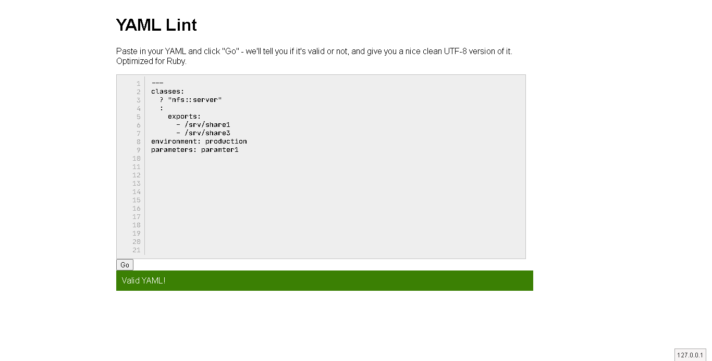
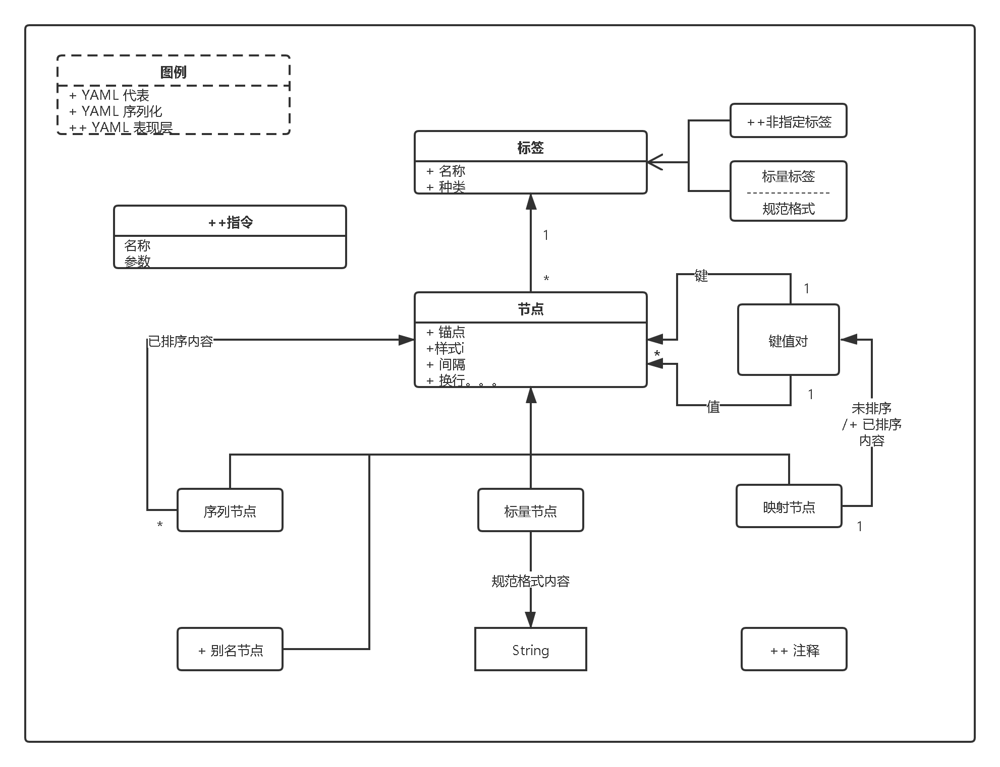
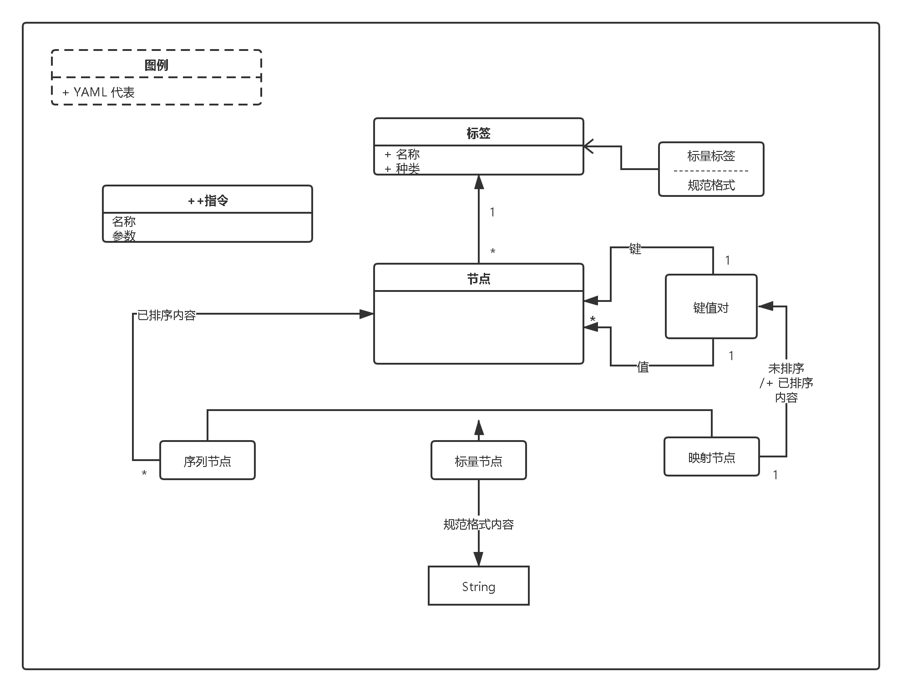

## YAML


`YAML` 不是标记语言,而是一种数据序列化语言

### 格式

- `YAML` 大小写敏感
- 拓展名须以 `.yaml` 作为拓展名
- `YAML` 不允许在创建 YAML 文件时使用`tab`键；
  允许使用空格代替

### 基础文件格式

使用连接符和空格开头

[basic](basic.yaml)

```yaml
--- # Favorite movies
- Casablanca
- North by Northwest
- The Man Who Wasn't There
```

### 内联格式

内敛格式的分隔符使用逗号和空格

[inline](inline.yaml)

```yaml
--- # Shopping list
[milk, groceries, eggs, juice, fruits]
```

### 折叠文本

[folderText](foldText.yaml)

```yaml
---

-{ name:John, age:33}
-name:Mary Smith
 age:27

men:[John Smith,Bill Jones]
women:
  - Mary Smith
  - Susan Williams
```

### 基本元素

- 注释以 `#` 开头

- 注释必须通过空格与其他标记(tokens)分开。

- 空格的缩进用于表示结构

- `Tab` 键不作为 `YAML` 文件的缩进。

- 列表成员由前导连字符（`-`）表示。

- 列表成员括在方括号中，并用逗号分隔。

- 关联数组使用冒号`:`表示，以键值对的形式表示。
  它们用大括号`{}`括起来。

- 具有单个流的多个文档用3个连字符（`---`）分隔。

- 每个文件中重复的节点最初都以 `&` 号表示，之后再以星号`*`表示。  

- `YAML` 始终要求将冒号和逗号用作列表分隔符，后跟带有标量值的空格。

- 节点应标有感叹号（`!`）或双感叹号（`!!`），后跟可以扩展为URI或URL的字符串。

### 缩进和分隔符

#### 缩进

特性：
- 不包含强制空格符
- 空格不需要保持一致性

需要记住的准则：
- 流块必须至少与周围的当前块级别有一定距离。
- 跨越多行的`YAML`的流内容。
  流内容需以`{`或`[` 开头。

观察以下显示缩进示例的代码-

```yaml
--- !clarkevans.com/^invoice
invoice: 34843
date   : 2001-01-23
bill-to: &id001
   given  : Chris
   family : Dumars
   address:
      lines: |
            458 Walkman Dr.
            Suite #292
      city    : Royal Oak
      state   : MI
      postal  : 48046
ship-to: *id001
product:
    - sku         : BL394D
      quantity    : 4
      description : Basketball
      price       : 450.00
   - sku         : BL4438H
      quantity    : 1
      description : Super Hoop
      price       : 2392.00
tax  : 251.42
total: 4443.52
comments: >
    Late afternoon is best.
    Backup contact is Nancy
    Billsmer @ 338-4338.
```

#### 分割

- 字符串之间用双引号引起来。
- 如果您在给定的字符串中,转义换行符，它将被完全删除并转换为空值。

示例1：

在此示例中，我们集中列出了具有字符串数据类型的数组结构形式的动物名称清单。
列出的每个新元素都带有连字符前缀，如前所述。

```yaml
-
 - Cat
 - Dog
 - Goldfish
-
 - Python
 - Lion
 - Tiger
```
示例2：

此示例引用了一组错误消息，用户只需提及关键方面即可使用该错误消息并相应地获取值。 YAML的这种模式遵循JSON的结构

```yaml
errors:
      messages:
         already_confirmed: "was already confirmed, please try signing in"
         confirmation_period_expired: "needs to be confirmed within %{period}, please request a new one"
         expired: "has expired, please request a new one"
         not_found: "not found"
         not_locked: "was not locked"
         not_saved:
            one: "1 error prohibited this %{resource} from being saved:"
            other: "%{count} errors prohibited this %{resource} from being saved:"
```

### 注释信息

在YAML中如何增加注释消息呢？

注意事项：

- `YAML` 支持单行注释。
- `YAML` 不支持单行注释。

单行注释的方式：

```yaml
# this is single line comment.
```
如果你想使用多行注释，请参考以下的方式：

```yaml
# this
# is a multiple
# line comment
```

注释信息的特性：

- 在执行期间将被跳过
- 有助于添加指定代码块的描述
- 不得出现在标量内
- `YAML`不包含任何转义哈希符号（`＃`）的方法，在多行字符串中也是如此，因此无法将注释从原始字符串值分开。

下面来看一组示例：

```yaml
key: #comment 1
   - value line 1
   #comment 2
   - value line 2
   #comment 3
   - value line 3
```

### 集合和结构体

- `YAML` 包含了使用缩进作为作用域的块集合
- 每个条目都以新行开头。
- 集合中的块序列用破折号和空格（`-`）表示每个条目。
- 块集合样式没有任何特定的指示符。
- `YAML`中的块集合可以通过标识其中包含的键值对来区别于其他标量。

映射是`JSON`结构中包含的键值的表示形式。
它经常用于多语言支持系统中，并应用于移动应用程序，用来创建`API`。
映射使用冒号和空格（`:`)键值对表示形式。

示例1：

一个标量序列的示例，例如一个如下所示的球运动员列表

```yaml
- Mark Joseph
- James Stephen
- Ken Griffey
```

示例2：

以下示例显示了将标量映射到标量-

```yaml
hr: 87
avg: 0.298
rbi: 149
```

示例3：

以下示例显示将标量映射到序列（或称为数组序列）-

```yaml
European:
- Boston Red Sox
- Detroit Tigers
- New York Yankees

national:
- New York Mets
- Chicago Cubs
- Atlanta Braves
```

集合可用于序列（数组序列的）映射，如下所示-

```yaml
-
name: Mark Joseph
hr: 87
avg: 0.278
-
name: James Stephen
hr: 63
avg: 0.288
```

对于集合，`YAML` 包括使用显式指示符而不是使用缩进来表示空格的流样式。
集合中的流程顺序用方括号括起来的逗号分隔列表表示。
`PHP` 框架（如 `Symphony` ）中包含的最佳收集插图。

```
[PHP, Perl, Python]
```

这些集合存储在文档中。
`YAML` 中的文档分隔用三个连字符或破折号（`---`）表示。
文档末尾标有三个点（`...`）。

文档表示形式称为结构格式，在下面提到-

```yaml
# Ranking of 1998 home runs
---
- Mark Joseph
- James Stephen
- Ken Griffey

# Team ranking
---
- Chicago Cubs
- St Louis Cardinals
```
带空格组合的问号表示结构上的复杂映射。
在图块集合中，用户可以包括带有破折号，冒号和问号的结构。
以下示例展示了序列之间的映射-

```yaml
- 2001-07-23
? [ New York Yankees,Atlanta Braves ]
: [ 2001-07-02, 2001-08-12, 2001-08-14]
```

### 标量和标签

`YAML` 使用意为（`|`）的字面量类型的块格式编写，它表示换行计数。
在`YAML`中，标量以折叠样式（`>`）书写，其中每行表示一个以空行或更多缩进的行结束的折叠空间。

保留在字面量中的新行如下所示-

```yaml
ASCII Art
--- |
\//||\/||
// || ||__
```
保留折叠的换行符，以便显示更多的缩进行和空白行，如下所示:

```yaml
>
Sammy Sosa completed another
fine season with great stats.
63 Home Runs
0.288 Batting Average
What a year!
```
`YAML`流标量包括普通样式和引用样式。
双引号样式包括各种转义序列。
流标量可以包含多条线；
在这种结构中，换行符总是折叠的。

```yaml
plain:
This unquoted scalar
spans many lines.
quoted: "So does this
quoted scalar.\n"
```
在`YAML`中，未标记的节点是使用特定类型的应用程序指定的。
标签规范的示例通常将 `seq` ， `map` 和 `str` 类型用于 `YAML` 标签存储库。
标签表示为示例，如下所述-

#### 整型标签

这些标记中包含整数值。
它们也称为数字标签。

```yaml
canonical: 12345
decimal: +12,345
sexagecimal: 3:25:45
octal: 014
hexadecimal: 0xC
```

#### 浮点型标签

这些标签包括十进制和指数值。
它们也称为指数标签

```yaml
canonical: 1.23015e+3
exponential: 12.3015e+02
sexagecimal: 20:30.15
fixed: 1,230.15
negative infinity: -.inf
not a number: .NaN
```

#### 杂项标签

它包括各种嵌入其中的整数，浮点和字符串值。
因此，它被称为杂项标签。

```yaml
null: ~
true: y
false: n
string: '12345'
```

### 完整长度示例

下面的完整示例指出了 `YAML` 的结构，其中包括符号和各种表示形式，它们在以 `JSON` 格式转换或处理它们时将非常有用。
这些属性在 `JSON` 文档中也称为键名。
创建这些表示法是出于安全目的。

上面的 `YAML` 格式代表默认值，适配器并具有各种其他属性。
YAML还保留生成的每个文件的日志，以跟踪生成的错误消息。
在将指定的 `YAML` 文件转换为 `JSON` 格式后，我们将获得所需的输出，如下所述-

```yaml
defaults: &defaults
   adapter:  postgres
   host:     localhost

development:
   database: myapp_development
   <<: *defaults

test:
   database: myapp_test
   <<: *defaults
```

将 `YAML` 转为 `JSON` 格式:

```yaml
{
   "defaults": {
      "adapter": "postgres",
      "host": "localhost"
   },
   "development": {
      "database": "myapp_development",
      "adapter": "postgres",
      "host": "localhost"
   },
   "test": {
      "database": "myapp_test",
      "adapter": "postgres",
      "host": "localhost"
   }
}
```

包含默认前缀和前缀“ `<<: *`”的键，并且在需要时不需要重复编写相同的代码片段。

### 程序

`YAML` 遵守程序的标准步骤。
`YAML` 中的本机数据结构包括简单的表示形式，例如节点。
它也称为表示节点图.

它包括映射，序列和标量，这些序列被序列化以创建序列化树。
通过序列化，对象将与字节流一起转换。

序列化事件树有助于创建字符流的表示形式，如下图所示。

反向过程将字节流解析为序列化的事件树。
之后，将节点转换为节点图。
这些值随后会在 `YAML` 本机数据结构中转换。
下图解释了这一点-

> 自己重新绘制的


- `YAML` 中的信息以两种方式使用：机器处理和人工消耗。
- `YAML` 中的处理器用作在上述图中互补视图之间转换信息的过程的工具。
- `YAML` 处理器必须在给定应用程序中提供的信息结构。
- `YAML` 包括用于以串行格式表示数据对象的序列化过程。
- `YAML` 信息的处理包括三个阶段：代表，序列化，表示和解析。


#### 代表

`YAML` 使用三种节点表示数据结构：序列，映射和标量。

##### 序列（类数组）

序列是指条目的有序数，它映射了键值对的无序关联。
它对应于 `Perl` 或 `Python` 数组列表。
下面显示的代码是序列表示的示例-

```yaml
product:
   - sku         : BL394D
     quantity    : 4
     description : Football
     price       : 450.00
   - sku         : BL4438H
     quantity    : 1
     description : Super Hoop
     price       : 2392.00
```
##### 映射

另一方面，映射表示字典数据结构或哈希表。
下面提到了一个相同的示例-

```yaml
batchLimit: 1000
threadCountLimit: 2
key: value
keyMapping: <What goes here?>
```

##### 标量

标量表示字符串，整数，日期和原子数据类型的标准值。
请注意，`YAML` 还包括指定数据类型结构的节点。


#### 序列化

`YAML` 中需要序列化过程，以简化人类友好的关键顺序和锚点名称。
序列化的结果是 `YAML` 序列化树。   
可以遍历它以产生一系列的 `YAML` 数据事件调用。

```yaml
consumer:
   class: 'AppBundle\Entity\consumer'
   attributes:
      filters: ['customer.search', 'customer.order', 'customer.boolean']
   collectionOperations:
      get:
         method: 'GET'
         normalization_context:
       groups: ['customer_list']
   itemOperations:
      get:
         method: 'GET'
         normalization_context:
            groups: ['customer_get']
```
#### 表现

`YAML` 序列化的最终输出称为 `presentation`。
它以人类友好的方式表示字符流。
`YAML` 处理器包括用于创建流，处理缩进和格式化内容的各种演示细节。
此完整过程由用户的偏好决定。

YAML表示过程的一个示例是创建 `JSON` 值的结果。
观察下面给出的代码以更好地理解-

```yaml
{
   "consumer": {
      "class": "AppBundle\\Entity\\consumer",
      "attributes": {
         "filters": [
            "customer.search",
            "customer.order",
            "customer.boolean"
         ]
      },
      "collectionOperations": {
         "get": {
            "method": "GET",
            "normalization_context": {
               "groups": [
                  "customer_list"
               ]
            }
         }
      },
      "itemOperations": {
         "get": {
            "method": "GET",
            "normalization_context": {
               "groups": [
                  "customer_get"
               ]
            }
         }
      }
   }
}
```

#### 解析

解析是表现的逆过程。
它包括字符流并创建一系列事件。
它丢弃表现过程中引入的导致序列化事件的细节。
解析过程可能由于输入格式错误而失败。
基本上，这是一个检查 `YAML` 格式是否正确的过程。
考虑下面提到的 `YAML` 示例-

```yaml
---
   environment: production
   classes:
      nfs::server:
         exports:
            - /srv/share1
            - /srv/share3
   parameters:
      paramter1
```

它带有三个连字符，表示文档的开始，之后定义了各种属性。
`YAML Lint` 是 `YAML` 的在线解析器，可帮助解析 `YAML` 结构以检查其是否有效。
下面提到了 `YAML Lint ` 的官方链接：

http://www.yamllint.com/

 您可以看到如下所示的解析输出-

 


### 信息模型

本章将详细解释上一章讨论的步骤和程序。 
`YAML` 中的信息模型将使用特定的图表以系统的格式指定序列化和表示过程的功能。

对于信息模型，重要的是要表示在编程环境之间可移植的应用程序信息。

> 图--自己绘制 



上面显示的图表示以图形格式表示的常规信息模型。
在 `YAML` 中，本机数据的表示方法是固定不动的，连接的，并且是标记节点的有向图。
如果我们提到有向图，它包括一组有向图的节点。
如信息模型中所述，`YAML` 支持三种节点，即-

- **Sequences** :序列化
- **Scalars**   :标量
- **Mappings**  :映射

上一章讨论了这些表示节点的基本定义。
在本章中，我们将重点介绍这些术语的示意图。
以下序列图表示具有各种类型的标签和映射节点的图例的工作流程。

> 图--自己绘制 



节点共有三种类型：序列节点，标量节点和映射节点。

- *序列*

序列节点遵循顺序体系结构，包括零个或多个节点的有序序列。 
`YAML` 序列可以重复包含相同节点或单个节点。

- *标量*

`YAML` 中的标量内容包括 `Unicode` 字符，这些字符可以用一系列零表示。
通常，标量节点包括标量。

- *映射*

映射节点包括键值对表示形式。
映射节点的内容包括键值对与必须保持键名唯一的强制性条件的组合。
序列和映射共同构成一个集合。
注意，如上图所示，标量，序列和映射以系统格式表示。